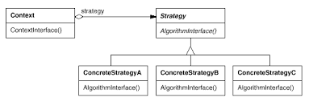

# 전략 패턴, 옵저버 패턴

- 참고
    
    목적에 따른 디자인 패턴 조직화
    
    - 생성 패턴(Creactional Pattern)
        - 객체 인스턴스 생성을 위한 패턴으로, 클라이언트와 그 클라이언트에서 생성해야 할 객체 인스턴스 사이의 연결을 끊어주는 패턴임
        - 객체의 생성 방식을 결정하는 데 표괄적인 솔루션을 제공하는 패턴임
        - 종류 : 추상 팩토리(Abstract Factory), 빌더(Builder), 팩토리 메소드(Factory Method), 프로토타입(Prototype), 싱글턴(Singleton) 패턴 등
    - 구조 패턴(Structural Patterns)
        - 클래스나 객체의 합성에 관한 패턴
        - 다른 기능을 가진 객체가 협력을 통해 어떤 역할을 수행할 때, 객체를 조직화시키는 일반적인 방식을 제시함
        - 클래스와 객체가 보다 큰 구조로 구성되는 방법에 대한 해결안을 제시함
        - 종류 : 어댑터(Adapter), 브리지(Bridge), 컴포지트(Composite), 데코레이터(Decorator), 다이나믹 링키지(Dynamic Linkage), 퍼샤드(Facade), 플라이웨이트(Flyweight), 프록시(Proxy), 가상 프록시(Virtual Proxy) 패턴 등
    - 행동 패턴(Behavioral Pattern)
        - 클래스나 객체들이 상호작용하는 방법과 책임을 분산하는 방법을 정의
        - 객체의 행위를 조직화(Organize), 관리(Manage), 연합(Combine)하는 데 사용되는 패턴임
        - 객체 간의 기능을 배분하는 일과 같은 알고리즘 수행에 주로 이용됨
        - 종류 : 책임 연쇄(Chain of Responsibility), 커맨드(Command), 인터프리터(Interpreter), 이터레이터(Iterator), 미디에이터(Mediator), 메멘토(Memento), 옵저버(Observer), 스테이트(State), 스트래티지(Strategy), 탬플릿 메소드(Template Method), 비지터(Visitor) 패턴 등
    
    |  | 생성 | 구조 | 행동 |
    | --- | --- | --- | --- |
    | 클래스 | 팩토리 메서드 | 적응자(class) | 해석자
    템플릿 메서드 |
    | 객체 | 추상 팩토리
    빌더
    원형
    단일체 | 적응자(object)
    가교
    복합체
    장식자
    퍼사드
    플라이급
    프록시 | 책임 연쇄
    명령
    해석자
    중재자
    메멘토
    감시자
    상태
    전략
    방문자 |

# 전략 패턴(Strategy pattern)


## 의도

- 객체의 행위를 바꾸고 싶은 경우, ‘직접’ 수정하지 않고 전략이라고 부르는 ‘캡슐화된 알고리즘’을 컨텍스트 안에서 바꿔주면서 상호 교체가 가능하게 만드는 패턴
    - 컨텍스트 : 프로그래밍에서의 컨텍스트는 상황, 맥락, 문맥을 의미하며, 개발자가 어떠한 작업을 완료하는 데 필요한 모든 관련 정보를 의미함
- 동일 계열의 알고리즘을 정의하고, 각 알고리즘을 캡슐화하며, 이들을 상호교환이 가능하도록 만듦. 알고리즘을 사용하는 클라이언트와 상관없이 독립적으로 알고리즘을 다양하게 변경할 수 있게 함

## 활용성

- 행동들이 조금씩 다를 뿐 개념적으로 관련된 많은 클래스들이 존재할 때, 전략 패턴은 많은 행동 중 하나를 가진 클래스를 구성할 수 있는 방법을 제공함
- 알고리즘의 변형이 필요할 때, 각 클래스에 서로 다른 알고리즘을 정의할 수 있음. 이러한 변형물들이 알고리즘의 상속 관계로 구현될 때 전략 패턴을 사용할 수 있음
- 사용자가 몰라야 하는 데이터를 사용하는 알고리즘이 있을 때, 노출하지 말아야 할 복잡한 자료 구조는 `Strategy` 클래스에만 두면 되므로 사용자는 몰라도 됨
- 하나의 클래스가 많은 행동을 정의하고, 이런 행동들이 그 클래스의 연산 안에서 복잡한 다중 조건문의 모습을 취할 때, 많은 조건문보다는 각각을 Strategy 클래스로 옮겨놓는 것이 좋음

## 구조



## 참여자

- `Strategy`
    - 제공하는 모든 알고리즘에 대한 공통의 연산들을 인터페이스로 정의함
    - `Context` 클래스는 `ConcreteStrategy` 클래스에 정의한 인터페이스를 통해서 실제 알고리즘을 사용함
- `ConcreteStrategy`
    - `Strategy` 인터페이스를 실제 알고리즘으로 구현함
- `Context`
    - `ConcreteStrategy` 객체를 통해 구성됨
    - `Strategy` 객체에 대한 참조자를 관리하고, 실제로는 `Strategy` 서브클래스의 인스턴스를 갖고 있음으로써 구체화함
    - `Strategy` 객체가 자료에 접근해가는 데 필요한 인터페이스를 정의함

## 협력 방법

- `Strategy` 클래스와 `Context` 클래스는 의사교환을 통해 선택한 알고리즘을 구현함. 즉, `Context` 클래스는 알고리즘에 해당하는 연산이 호출되면, 알고리즘 처리에 필요한 모든 데이터를 `Strategy` 클래스로 보냄. 이때, `Context` 객체 자체를 `Strategy` 연산에다가 인자로 전송할 수도 있음
- `Context` 클래스는 사용자 쪽에서 온 요청을 각 전략 객체로 전달함. 이를 위해서 사용자는 필요한 알고리즘에 해당하는 `ConcreteStrategy` 객체를 생성하여 이를 `Context` 클래스에 전송하는데, 이 과정을 거치면 사용자는 `Context` 객체와 동작할 때 전달한 `ConcreteStrategy` 객체가 함께 동작함. 사용자가 선택할 수 있는 동일 계열의 `ConcreteStrategy` 클래스군이 준비될 때가 자주 있음

## 결과(장/단점)

1. 동일 계열의 관련 알고리즘군이 생김
    - `Strategy` 클래스 계층은 동일 계열의 알고리즘군 혹은 행동군을 정의함
    - 이런 알고리즘 자체의 재사용도 가능함(????????????????)
    - 즉, 상속을 통해서 알고리즘 공통의 기능성들을 추출하고 이를 재사용할 수 있음
2. 서브클래싱을 사용하지 않는 대안임
    - 상속은 다양한 알고리즘이나 행동을 지원하는 또 다른 방법임. 서로 다른 행동을 제공하기 위해 `Context` 클래스를 직접 상속받을 수 있으나 이렇게 행동의 처리 방법을 `Context`에 직접 코딩하면 추후 수정이 어려워짐. 즉, `Context` 자체의 행동과 알고리즘이 혼합되어 `Context` 클래스를 이해하거나 유지보수하기 어려움
    - 알고리즘을 `Strategy` 클래스로 독립시키면 `Context`와 무관하게 알고리즘을 변형시킬 수 있고, 알고리즘을 바꾸거나 이해하거나 확장하기도 쉬움
3. 조건문을 없앨 수 있음
    - 전략 패턴을 사용하면 원하는 행동들을 선택하는 조건문을 없앨 수 있음
    - 서로 다른 행동이 하나로 묶이면 조건문을 사용해서 정확한 행동을 선택할 수밖에 없음
        - 그러나 서로 다른 `Strategy` 클래스의 행동을 캡슐화하면 이들 조건문을 없앨 수 있음
4. 구현의 선택이 가능함
    - 동일한 행동에 대해서 서로 다른 구현을 제공할 수 있음
    - 사용자는 서로 다른 시간과 공간이 필요한 여러 `Strategy`들 중 하나를 선택할 수 있게 됨
5. 사용자(프로그램)는 서로 다른 전략을 알아야 함
    - 사용자는 적당한 전략을 선택하기 전에 전략들이 어떻게 다른지 이해해야 함
    - 이를 위해 사용자는 각 구현 내용을 모두 알아야 함
    - 그러므로 사용자가 이렇게 서로 다른 행동 각각의 특징을 이미 알고 있을 때 전략 패턴을 사용함
6. `Strategy` 객체와 `Context` 객체 사이에 의사소통 오버헤드가 있음
    - 서브클래스에서 구현할 알고리즘의 복잡함과는 상관없이 모든 `ConcreteStrategy` 클래스는 `Strategy` 인터페이스를 공유함
    - 따라서 어떤 `ConcreteStrategy` 클래스는 이 인터페이스를 통해 들어온 모든 정보를 다 사용하지 않는데도 이 정보를 떠안아야 할 때가 생김

## 전략 패턴 사용 예시(Python)

1. 여행 전략을 정의하는 인터페이스(파이썬에서는 추상 기본 클래스를 사용)

```python
from abc import ABC, abstractmethod

class TravelStrategy(ABC):
    @abstractmethod
    def travel_to(self, destination):
        pass
```

1. `TravelStrategy`를 구현하는 구체적인 전략 클래스들을 정의

```python
class CarTravelStrategy(TravelStrategy):
    def travel_to(self, destination):
        print(f"자동차로 {destination}까지 여행합니다.")

class PublicTransportStrategy(TravelStrategy):
    def travel_to(self, destination):
        print(f"대중교통을 이용하여 {destination}까지 여행합니다.")

class WalkStrategy(TravelStrategy):
    def travel_to(self, destination):
        print(f"도보로 {destination}까지 여행합니다.")
```

1. 전략을 사용하는 컨텍스트(`Context`) 클래스를 정의 ← 여행 전략을 설정하고 해당 전략을 사용하여 여행을 계획함

```python
class TravelContext:
    def __init__(self, strategy: TravelStrategy):
        self._strategy = strategy

    def set_strategy(self, strategy: TravelStrategy):
        self._strategy = strategy

    def travel(self, destination):
        self._strategy.travel_to(destination)
```

1. 전략 패턴을 사용

```python
# 전략 객체 생성
car_strategy = CarTravelStrategy()
walk_strategy = WalkStrategy()
public_transport_strategy = PublicTransportStrategy()

# 여행 컨텍스트 생성 및 전략 설정
travel_context = TravelContext(car_strategy)
travel_context.travel("부산")  # 자동차 전략 사용

travel_context.set_strategy(walk_strategy)
travel_context.travel("근처 공원")  # 도보 전략 사용

travel_context.set_strategy(public_transport_strategy)
travel_context.travel("서울")  # 대중교통 전략 사용
```

## 전략 패턴 사용 예시(Java)

```java
import java.text.DecimalFormat;
import java.util.ArrayList;
import java.util.List;
interface PaymentStrategy { 
    public void pay(int amount);
}

class KAKAOCardStrategy implements PaymentStrategy {
    private String name;
    private String cardNumber;
    private String cvv;
    private String dateOfExpiry;
    
    public KAKAOCardStrategy(String nm, String ccNum, String cvv, String expiryDate) {
        this.name = nm;
        this.cardNumber = ccNum;
        this.cvv = cvv;
        this.dateOfExpiry = expiryDate;
    }

    @Override
    public void pay(int amount) {
        System.out.println(amount + " paid using KAKAOCard.");
    }
} 

class LUNACardStrategy implements PaymentStrategy {
    private String emailId;
    private String password;
    
    public LUNACardStrategy(String email, String pwd) {
        this.emailId = email;
        this.password = pwd;
    }
  
    @Override
    public void pay(int amount) {
        System.out.println(amount + " paid using LUNACard.");
    }
}

class Item { 
    private String name;
    private int price; 
    public Item(String name, int cost) {
        this.name = name;
        this.price = cost;
    }

    public String getName() {
        return name;
    }

    public int getPrice() {
        return price;
    }
} 

class ShoppingCart { 
    List<Item> items;
    
    public ShoppingCart() {
        this.items = new ArrayList<Item>();
    }
    
    public void addItem(Item item) {
        this.items.add(item);
    }
    
    public void removeItem(Item item) {
        this.items.remove(item);
    }
    
    public int calculateTotal() {
        int sum = 0;
        for (Item item : items) {
            sum += item.getPrice();
        }
        return sum;
    }
    
    public void pay(PaymentStrategy paymentMethod) {
        int amount = calculateTotal();
        paymentMethod.pay(amount);
    }
}  

public class HelloWorld {
    public static void main(String[] args) {
        ShoppingCart cart = new ShoppingCart();
        
        Item A = new Item("kundolA", 100);
        Item B = new Item("kundolB", 300);
        
        cart.addItem(A);
        cart.addItem(B);
        
        // pay by LUNACard
        cart.pay(new LUNACardStrategy("kundol@example.com","pukubababo"));
        
        // pay by KAKAOCard
        cart.pay(new KAKAOCardStrategy("Ju hongchul", "123456789","123","12/01"));
    }
}
/*
400 paid using LUNACard.
400 paid using KAKAOCard.
*/
```

# 옵저버 패턴(Observer pattern)


## 의도

- 객체 사이에 일 대 다의 의존 관계를 두어, 어떤 객체의 상태가 변할 때 그 객체에 의존성을 가진 다른 객체들이 그 변화를 통지받고 자동으로 갱신될 수 있게 만듦

## 다른 이름

- 종속자(Dependent)
- 게시-구독(Publish-Subscribe)

## 동기

- 어떤 하나의 시스템을 서로 연동되는 클래스 집합으로 분할했을 때 발생하는 공통적인 부작용은 관련된 객체 간에 일관성을 유지하도록 해야 한다는 것임. 그렇다고 이 일관성 관리를 위해서 객체 간의 결합도를 높이고 싶지는 않음. 그렇게 되면 각 클래스의 재사용이 떨어지기 때문임.
- 스프레드시트와 바 차트는 데이터 객체에 종속적이기 때문에 그 데이터에 일어난 변경을 통보받아야 함. 그러나 반드시 이 예처럼 종속적인 객체의 개수가 두 개로 제한되는 것은 아님. 서로 다른 다수의 사용자 인터페이스가 하나의 데이터에 종속될 수 있음.


- 감시자(Observer) 패턴은 이런 관련성을 관리하는 패턴임. 이 패턴에서 중요한 객체는 주체(Subject)와 감시자(Observer)임. 주체는 독립된 여러 개의 감시가 있을 수 있으며, 모든 감시자는 주체의 상태 변화가 있을 때마다 이 변화를 통보받음. 각 감시자는 주체의 상태와 자신의 상태를 둥기화시키기 위해 주체의 상태를 알아봄.

## 활용성

- 어떤 추상 개념이 두 가지 양상을 갖고 하나가 다른 하나에 종속적일 때, 각 양상을 별도의 객체로 캡슐화하여 이들 각각을 재사용할 수 있음
- 한 객체에 가해진 변경으로 다른 객체를 변경해야 하고, 프로그래머들은 얼마나 많은 객체들이 변경되어야 하는지 몰라도 될 때
- 어떤 객체가 다른 객체에 자신의 변화를 통보할 수 있는데, 그 변화에 관심 있어 하는 객체들이 누구인지에 대한 가정 없이도 그러한 통보가 될 때

## 구조


## 참여자

- `Subject`
    - 감시자들을 알고 있는 주체
    - 임의 개수의 감시자 객체는 주체를 감시할 수 있음
    - 주체는 감시자 객체를 붙이거나 떼는 데 필요한 인터페이스를 제공함
- `Observer`
    - 주체에 생긴 변화에 관심 있는 객체를 갱신하는 데 필요한 인터페이스를 정의함
    - 이로써 주체의 변경에 따라 변화되어야 하는 객체들의 일관성을 유지함
- `ConcreteSubject`
    - `ConcreteObserver` 객체에게 알려주어야 하는 상태를 저장함
    - 이 상태가 변경될 때 감시자에게 변경을 통보함
- `ConcreteObserver`
    - `ConcreteSubject` 객체에 대한 참조자를 관리함
    - 주체의 상태와 일관성을 유지해야 하는 상태를 저장함
    - 주체의 상태와 감시자의 상태를 일관되게 유지하는 데 사용하는 갱신 인터페이스를 구현함

## 협력 방법

- `ConcreteSubject`는 `Observer`의 상태와 자신의 상태가 달라지는 변경이 발생할 때마다 감시자에게 통보함
- `ConcreteSubject`에서 변경이 통보된 후, `ConcreteObserver`는 필요한 정보를 주체에게 질의하여 얻어옴. `ConcreteObserver`는 이 정보를 이용해서 주체의 상태와 자신의 상태를 일치시킴

## 결과

- 감시자 패턴을 사용하게 되면 주체 및 감시자 모두를 독립적으로 변형하기 쉬움
- 감시자를 재사용하지 않고도 주체를 재사용할 수 있고, 주체 없이도 감시자를 재사용할 수 있음
- 주체나 감시자의 수정 없이도 감시자를 추가할 수 있음
- `Subject`와 `Observer` 클래스 간에는 추상적인 결합도만이 존재함
- 브로드캐스트 방식의 교류를 가능하게 함
- 예측하지 못한 정보를 갱신함

## 옵저버 패턴 사용 예시(Python)

뉴스 업데이트 시스템

1. 옵저버와 관찰 대상이 될 주제(Subject)의 인터페이스 정의

```python
from abc import ABC, abstractmethod

class Observer(ABC):
    @abstractmethod
    def update(self, message):
        pass

class Subject(ABC):
    @abstractmethod
    def attach(self, observer: Observer):
        pass

    @abstractmethod
    def detach(self, observer: Observer):
        pass

    @abstractmethod
    def notify(self):
        pass
```

1. Subject 인터페이스를 구현하는 구체적인 클래스 만들기 (이 클래스는 뉴스 업데이트를 관리함)

```python
class NewsPublisher(Subject):
    def __init__(self):
        self._observers = []
        self._latest_news = None

    def attach(self, observer: Observer):
        self._observers.append(observer)

    def detach(self, observer: Observer):
        self._observers.remove(observer)

    def notify(self):
        for observer in self._observers:
            observer.update(self._latest_news)

    def add_news(self, news):
        self._latest_news = news
        self.notify()

    def get_news(self):
        return self._latest_news
```

1. Observer 인터페이스를 구현하는 구체적인 관찰자 클래스들을 만듦. 각 관찰자는 뉴스 업데이트를 받으면 자신만의 방식으로 처리함

```python
class EmailSubscriber(Observer):
    def update(self, message):
        print(f"이메일 구독자에게 뉴스 업데이트 알림: {message}")

class SMSSubscriber(Observer):
    def update(self, message):
        print(f"SMS 구독자에게 뉴스 업데이트 알림: {message}")

class AppNotificationSubscriber(Observer):
    def update(self, message):
        print(f"앱 알림 구독자에게 뉴스 업데이트 알림: {message}")
```

1. 이 시스템을 사용하는 예시

```python
# 뉴스 발행자 객체 생성
news_publisher = NewsPublisher()

# 구독자 객체 생성 및 뉴스 발행자에 등록
email_subscriber = EmailSubscriber()
news_publisher.attach(email_subscriber)

sms_subscriber = SMSSubscriber()
news_publisher.attach(sms_subscriber)

app_subscriber = AppNotificationSubscriber()
news_publisher.attach(app_subscriber)

# 뉴스 업데이트 및 알림
news_publisher.add_news("오늘의 뉴스 업데이트입니다.")
# 각 구독자에게 뉴스 업데이트 알림이 전송됩니다.

# 구독자 중 하나를 해지
news_publisher.detach(sms_subscriber)

# 새 뉴스 업데이트 및 알림
news_publisher.add_news("또 다른 뉴스 업데이트입니다.")
# SMS 구독자를 제외한 나머지 구독자에게만 알림이 전송됩니다.
```