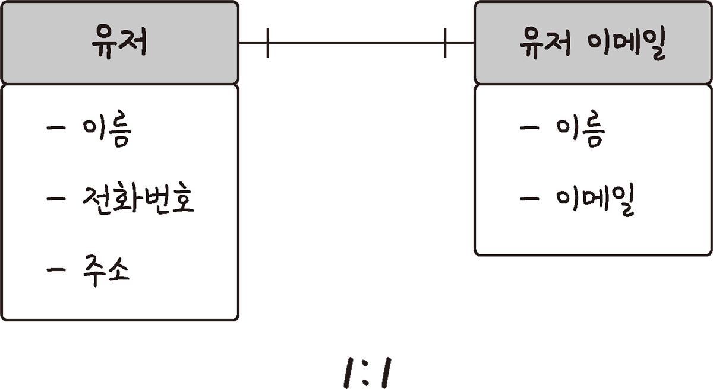
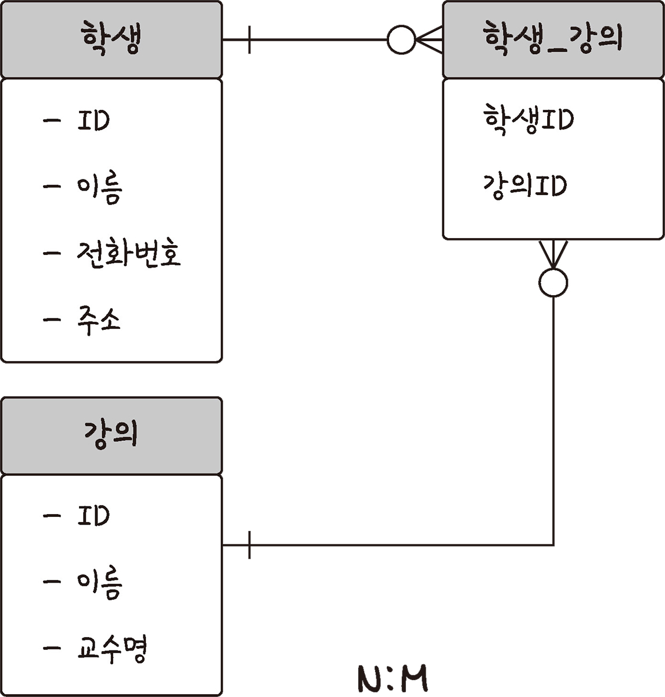

# 4.1 |  데이터베이스의 기본

# 데이터베이스(DB, DataBase)

> 일정한 규칙, 혹은 규약을 통해 구조화되어 저장되는 데이터의 모음
> 
- 데이터베이스의 정의
    - **통합 데이터(Integrated Data)** : 데이터베이스에 동일한 내용의 데이터가 중복되어 있지 않다는 것을 의미함
    - **저장 데이터(Stored Data)** : 컴퓨터가 접근할 수 있는 저장 매체에 저장되는 것을 의미함
    - **운영 데이터(Operational Data)** : 조직의 고유한 업무를 수행하기 위해 필요한 데이터를 의미함
    - **공용 데이터(Shared Data)** : 여러 사용자가 서로 다른 목적으로 데이터베이스의 데이터를 공동으로 이용할 수 있는 것을 의미함
- 데이터베이스의 특징
    - **실시간 접근성(Real Time Accessibility)** : 원하는 결과를 수초 내에 실시간으로 서비스할 수 있어야 함
    - **계속적인 변화(Continuous Change)** : 데이터베이스는 시간에 따라 항상 변경되며, 삽입/삭제/수정 등의 작업을 통하여 변경된 데이터 값을 저장해야 함
    - **동시 공유(Concurrent Sharing)** : 데이터베이스를 서로 다른 업무 혹은 여러 사용자에게 동시 공유할 수 있어야 함
    - **내용에 따른 참조(Reference by Content)** : 데이터의 물리적 위치가 아니라 데이터의 내용에 따라 참조할 수 있어야 함 (주소에 의한 참조 X)
- **DBMS(DataBase Management System)**
    - 데이터베이스의 구성과 저장, 접근 방법, 유지 및 관리를 위한 소프트웨어
    - 물리적으로 저장된 데이터를 관리하고 접근하도록 지원하는 소프트웨어
    - 사용자와 데이터베이스의 중재자로서 모든 사용자나 응용 프로그램들이 데이터베이스를 공유할 수 있도록 관리해 주는 소프트웨어 시스템
    - 모든 응용 프로그램들의 데이터베이스 접근은 DBMS를 통해서만 가능함
- 데이터베이스 안에 있는 데이터들은 특정 DBMS마다 정의된 **쿼리 언어(query language)**를 통해 **삽입, 삭제, 수정, 조회** 등을 수행할 수 있음
- 실시간 접근과 동시 공유가 가능함


- DBMS의 필수 기능
    - 정의 기능 : 데이터의 형태, 구조, 데이터베이스의 저장에 관한 내용 정의
        - DDL(데이터 정의어) : `CREATE`, `ALTER`, `DROP`, `RENAME`
    - 조작 기능 : 사용자의 요구에 따라 검색, 갱신, 삽입, 삭제 등을 지원하는 기능
        - DML(데이터 조작어) : `SELECT`, `INSERT`, `UPDATE`, `DELETE`
    - 제어 기능 : 정확성과 안정성을 유지하는 기능(무결성 유지, 보안(권한) 검사, 병행 수행 제어)
        - DCL(데이터 제어어) : `GRANT`, `REVOKE`

# 엔터티(Entity)

> 사람, 장소, 물건, 사건, 개념 등 **여러 개의 속성**을 지닌 **개체**를 의미함
> 
- 단독으로 존재하며 다른 것과 구분되는 객체
- 개체는 속성(애트리뷰트)들의 집합을 가짐


## 엔터티 도출 예시

<aside>
📌 비즈니스 프로세스 사례

1. 고객이 회원가입을 한다. 회원으로 가입할 때는 회원ID, 패스워드, 이름, 주소, 전화번호 등을 입력해야 한다.
2. 회원으로 가입하기 위해서는 반드시 하나의 계좌를 개설해야 한다.
3. 고객은 계좌를 여러 개 개설할 수 있다.
4. 계좌를 개설할 때는 계좌번호, 계좌명, 예수금, 계좌개설 지점, 계좌담당자가 입력된다.
</aside>

## 약한 엔터티와 강한 엔터티

- A 엔터티가 혼자 존재하지 못하고 B 엔터티의 존재 여부에 따라 종속적이면
    - A : 약한 엔터티
    - B : 강한 엔터티

### (참고) 엔터티의 종류

- 유형과 무형에 따른 종류
    
    
    | 종류 | 설명 |
    | --- | --- |
    | 유형 엔터티 | - 업무에서 도출되며 지속적으로 사용되는 엔터티
    - e.g. 고객, 강사, 사원 등 |
    | 개념 엔터티 | - 유형 엔터티는 물리적 형태가 있지만, 개념 엔터티는 물리적 형태가 없음
    - 개념적으로 사용되는 엔터티
    - e.g. 거래소 종목, 코스닥 종목, 생명보험 상품 |
    | 사건 엔터티 | - 비즈니스 프로세스를 실행하면서 생성되는 엔터티
    - e.g. 주문, 체결, 취소주문, 수수로 청구 등 |
- 발생 시점에 따른 종류
    
    
    | 종류 | 설명 |
    | --- | --- |
    | 기본 엔터티
    (Basic) | - 키 엔터티라고도 함
    - 다른 엔터티로부터 영향을 받지 않고 독립적으로 생성되는 엔터티
    - e.g. 고객, 상품, 부서 등 |
    | 중심 엔터티
    (Main) | - 기본 엔터티와 행위 엔터티 간의 중간에 있는 것
    - 기본 엔터티로부터 발생되고 행위 엔터티를 생성하는 것
    - e.g. 계좌, 주문, 취소, 체결 등 |
    | 행위 엔터티
    (Active) | - 2개 이상의 엔터티로부터 발생
    - e.g. 주문 이력, 체결 이력 등 |

# 릴레이션(Relation)

> 데이터베이스에서 정보를 구분하여 저장하는 기본 단위
> 
> 
> 정보 저장의 기본 형태가 2차원 구조의 표 또는 테이블로 표현되는 모델
> 
- 엔터티에 대한 데이터를 데이터베이스는 릴레이션 하나에 담아서 관리함
- 릴레이션 스킴(Relation Scheme) + 릴레이션 인스턴스(Relation Instance)


- 관계형 DB에서의 릴레이션 : **테이블**
- NoSQL DB에서의 릴레이션 : **컬렉션**
- 릴레이션의 특성
    - **튜플의 유일성** : 릴레이션의 튜플들은 중복되지 않고 모두 상이함
    - **튜플의 무순서성** : 한 릴레이션에 포함된 튜플 사이에는 순서가 없음
    - **애트리뷰트의 무순서성** : 릴레이션에서 애트리뷰트들 간의 순서는 의미가 없음
    - **애트리뷰터의 원자성** : 모든 애트리뷰트는 원자값을 가지며, 애트리뷰터의 값은 논리적으로 분해가 불가능함

## 테이블과 컬렉션

- 관계형 데이터베이스(MySQL)의 구조
    - 레코드 < 테이블 < 데이터베이스
- NoSQL(MongoDB)의 구조
    - 도큐먼트 < 컬렉션 < 데이터베이스

# 속성(Attribute)

> 릴레이션에서 관리하는 구체적이며 고유한 이름을 갖는 정보
> 
- 서비스의 요구 사항을 기반으로 관리해야 할 필요가 있는 속성들만 엔터티의 속성이 됨
- 더 이상 분리되지 않는 단위
- 인스턴스의 구성 요소이고, 의미적으로 더 이상 분리되지 않음
- 주식별자에게 함수적으로 종속됨. 즉, 기본키가 변경되면 속성의 값도 변경된다는 것임

### (참고) 속성의 종류

- 분해 여부에 따른 속성의 종류
    
    
    | 종류 | 설명 |
    | --- | --- |
    | 단일 속성 | - 하나의 의미로 구성된 것
    - e.g. 회원ID, 이름 등 |
    | 복합 속성 | - 여러 개의 의미가 있는 것
    - e.g. 주소 : 시 + 군 + 동으로 분해될 수 있음 |
    | 다중값 속성 | - 속성에 여러 가지 값을 가질 수 있는 것
    - 다중값 속성은 엔터티로 분해됨
    - e.g. 상품 리스트 |
- 특성에 따른 속성의 종류
    
    
    | 종류 | 설명 |
    | --- | --- |
    | 기본 속성 | - 비즈니스 프로세스에서 도출되는 본래의 속성
    - e.g. 회원ID, 이름, 계좌번호, 주문 일자 등 |
    | 설계 속성 | - 데이터 모델링 과정에서 발생되는 속성
    - 유일한 값을 부여
    - e.g. 상품코드, 지점코드 등 |
    | 파생 속성 | - 다른 속성에 의해서 만들어지는 속성
    - e.g. 합계, 평균 등 |

# 도메인(Domain)

> 릴레이션에 포함된 각각의 속성들이 가질 수 있는 **값의 집합**
> 
- e.g. 학년 ⇒ {1, 2, 4}
    
    
    

# 필드와 레코드


- 회원이라는 **엔터티**는 member라는 **테이블**에 구성된 **속성**인 이름, 아이디 등을 가지고 있으며 name, ID, address 등의 **필드**를 가짐
- **레코드** : 테이블의 행(row) 단위의 데이터 (튜플)
- ‘책’이라는 엔터티를 정의하고, 이를 기반으로 테이블을 만드는 경우
    - 책의 아이디(id) : `INT`
    - 책의 제목(title) : `VARCHAR(255)`
    - 책의 저자 아이디(author_id) : `INT`
    - 책의 출판년도(publishing_year) : `VARCHAR(255)`
    - 책의 장르(genre) : `VARCHAR(255)`
    - 생성 일시(created_at) : `DATETIME`
    - 업데이트 일시(updated_at) : `DATETIME`
    
    ```sql
    CREATE TABLE book(
    	id INT NOT NULL AUTO_INCREMENT,
    	title VARCHAR(255),
    	author_id INT,
    	publishing_year VARCHAR(255),
    	genre VARCHAR(255),
    	created_at DATETIME,
    	updated_at DATETIME,
    	PRIMARY KEY (id)
    );
    ```
    

## 필드 타입 (MySQL 기준)

### 숫자 타입

| 타입 | 용량(바이트) | 최솟값(부호 있음) | 최솟값(부호 없음) | 최댓값(부호 없음) | 최댓값(부호 있음) |
| --- | --- | --- | --- | --- | --- |
| TINYINT  | 1 | -128 | 0 | 127 | 255 |
| SMALLINT  | 2 | -32768 | 0 | 32767 | 65535 |
| MEDIUMINT  | 3 | -8388608 | 0 | 8388707 | 16777215 |
| INT  | 4 | -2147483648 | 0 | 2147483647 | 4294967295 |
| BIGINT  | 8 | -263 | 0 | 263-1 | 264-1 |

### 날짜 타입

- `DATE`
    - 날짜 부분은 있지만 시간 부분은 없는 값에 사용됨
    - 범위 : 1000-01-01 ~ 9999-12-31
    - 용량 : 3byte
- `DATETIME`
    - 날짜 및 시간 부분을 모두 포함하는 값에 사용됨
    - 범위 : 1000-01-01 00:00:00 ~ 9999-12-31 23:59:59
    - 용량 : 8byte
- `TIMESTAMP`
    - 날짜 및 시간 부분을 모두 포함하는 값에 사용됨
    - 범위 : 1970-01-01 00:00:01 ~ 2038-01-19 03:14:07
    - 용량 : 4byte

### 문자 타입

- `CHAR` 와 `VARCHAR`
    - 그 안에 수를 입력해서 몇 자까지 입력할지 정함
    - e.g. `CHAR(30)`  : 최대 30글자까지 입력 가능
    - `CHAR` 는 고정 길이 문자열(테이블을 생성할 때 선언한 길이), 0~255 사이의 값
    - `VARCHAR` 는 가변 길이 문자열, 0~65535 사이의 값, 입력된 데이터에 따라 용량을 가변시켜 저장함
        - e.g. 10글자 이메일 저장하는 경우 ⇒ {10글자 바이트 + 길이 기록용 1바이트}로 저장
- `TEXT` 와 `BLOB`
    - 큰 데이터를 저장하는 데 쓰는 타입
    - `TEXT`  : 큰 문자열 저장에 쓰며 주로 게시판의 본문을 저장할 때 씀
    - `BLOB`  : 이미지, 동영상 등 큰 데이터 저장에 씀
        - 실제로는 별도의 이미지 호스팅 서비스에 파일을 업로드한 후, 파일 경로를 VARCHAR로 저장함
- `ENUM` 과 `SET`
    - 문자열을 열거한 타입
    - 공간적으로 효율적
    - 애플리케이션 수정에 따라 데이터베이스의 `ENUM` 이나 `SET` 에서 정의한 목록을 수정해야 한다는 단점
    - `ENUM`
        - `ENUM('x-small', 'small', 'medium', 'large', 'x-large')`  형태
        - 문자열 하나만 선택하는 단일 선택만 가능
        - `ENUM`  리스트에 없는 잘못된 값을 삽입하면 빈 문자열이 대신 삽입됨
        - ‘x-small’ 등이 0, 1 등으로 매핑되어 메모리 절약
        - 최대 65,535개의 요소를 넣을 수 있음
    - `SET`
        - 여러 개의 데이터를 선택 가능
        - 비트 단위의 연산 가능
        - 최대 64개의 요소를 넣을 수 있음

# 관계(Relationship)

> 개체(Entity) 집합의 구성 원소인 인스턴스 사이의 대응성(Correspondence), 즉 사상(Mapping)을 의미함
> 


관계화살표

## 1:1 관계



## 1:N 관계


## N:M 관계



# 키(Key)

> 테이블 간의 관계를 조금 더 명확하게 하고 테이블 자체의 인덱스를 위해 설정된 장치
> 


키 간의 관계

## 기본키(PK, Primary Key)

> **유일성**과 **최소성**을 만족하는 키
> 


- 테이블의 데이터 중 고유하게 존재하는 속성
- 기본키는 그 키 값으로 튜플을 대표하기 때문에 기본키가 널(Null) 값을 포함하면 유일성이 깨짐
- 기본키에 해당하는 데이터는 상단 좌측 그림의 ID처럼 중복되어서는 안 됨
- 상단 그림 중 좌측의 경우, ID는 기본키가 되면 안 됨
- 우측의 ID는 기본키로 사용 가능함

### 자연키

> 중복된 값들을 제외하며 중복되지 않은 것을 ‘자연스레’ 뽑다가 나오는 키
> 
- 언젠가 변하는 속성을 지님
- e.g. 유저 테이블을 만드는 경우
    - 이름, 성별 등은 중복된 값이 들어올 수 있으므로 기본키로서 부적절함
    - 주민등록번호는 기본키로서 적절

### 인조키

> 인위적으로 생성한 키
> 
- 자연키와는 다르게 변하지 않음
- 보통 기본키는 인조키로 설정함
- e.g. 유저 테이블을 만드는 경우
    - 주민등록번호, 이름, 성별 등의 속성이 있음
    - 여기에 인위적으로 유저 아이디를 부여함으로써 고유 식별자 생성

## 외래키(FK, Foreign Key)

> 다른 테이블의 기본키를 참조하는 값
> 
> 
> 다른 테이블을 참조하는 데 사용되는 속성
> 
- 개체와의 관계를 식별하는 데 사용함
- 중복되어도 상관 없음
- 아래 그림의 경우, client 테이블의 기본키인 ID가 product 테이블의 user_id라는 외래키로 설정됨
- client 테이블 : 참조되는 릴레이션(Referenced Relation)  /  product 테이블 : 참조하는 릴레이션(Referencing Relation)


## 후보키(candidate key)

> 기본키가 될 수 있는 후보들
> 
> 
> 유일성과 최소성을 동시에 만족하는 키
> 

## 대체키(alternate key)

> 후보키가 두 개 이상일 경우, 어느 하나를 기본키로 지정하고 남은 후보키들이 해당함
> 

## 슈퍼키(super key)

> 한 릴레이션 내의 속성들로 집합된 키
> 
> 
> 릴레이션을 구성하는 모든 튜플에 대한 유일성은 만족하지만 최소성은 만족하지 못하는 키 
>