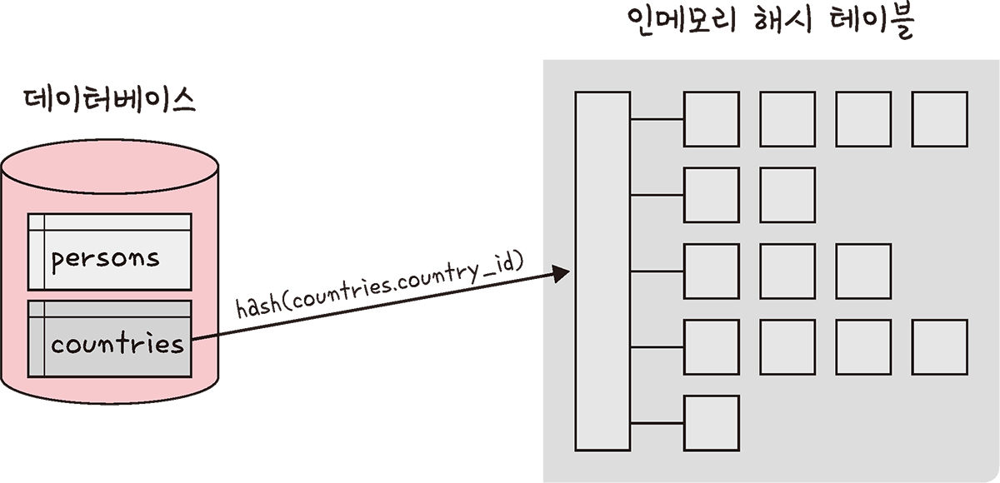
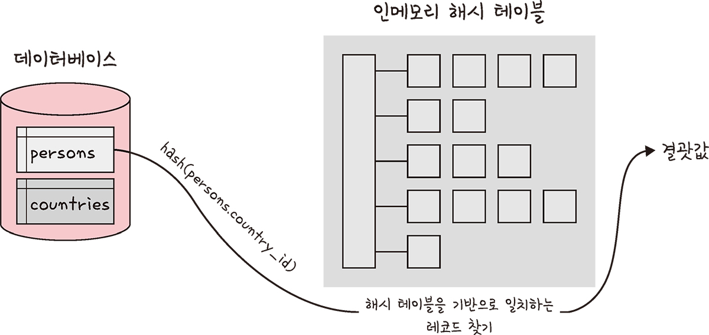

# 4.7 | 조인의 원리


## 1️⃣ 중첩 루프 조인(NLJ, Nested Loop Join)

- 중첩 for문과 같은 원리로 조건에 맞는 조인을 하는 방법
- 랜덤 접근에 대한 비용이 많이 증가하므로 대용량의 테이블에서는 사용하지 않음
- e.g. “t1, t2 테이블을 조인한다.”
    - 첫 번째 테이블에서 행을 한 번에 하나씩 읽고 그 다음 테이블에서도 행을 하나씩 읽어 조건에 맞는 레코드를 찾아 결괏값을 반환

```jsx
// pseudo code
for each row in t1 matching reference key {
	for each row in t2 matching reference key {
		if row satisfies join conditions, send to client
```

<aside>
💡 ref. 블록 중첩 루프 조인(BNL, Block Nested Loop)

조인할 테이블을 작은 블록으로 나눠서 블록 하나씩 조인하는 방식

</aside>

## 2️⃣ 정렬 병합 조인

- 각각의 테이블을 조인할 필드 기준으로 정렬하고 정렬이 끝난 이후에 조인 작업을 수행하는 방식
- 조인할 때 쓸 적절한 인덱스가 없고 테이블들을 조인하고 조인 조건으로 <, > 등 범위 비교 연산자가 있을 때 사용
- 예시

Sailors의 인스턴스

| sid | sname | rating | age |
| --- | --- | --- | --- |
| 22 | dustin | 7 | 45.0 |
| 28 | yuppy | 9 | 35.0 |
| 31 | lubber | 8 | 55.5 |
| 36 | lubber | 6 | 36.0 |
| 44 | guppy | 5 | 35.0 |
| 58 | rusty | 10 | 35.0 |

Reserves의 인스턴스

| sid | bid | day | rname |
| --- | --- | --- | --- |
| 28 | 103 | 12/04/96 | guppy |
| 28 | 103 | 11/03/96 | yuppy |
| 31 | 101 | 10/10/96 | dustin |
| 31 | 102 | 10/12/96 | lubber |
| 31 | 101 | 10/11/96 | lubber |
| 58 | 103 | 11/12/96 | dustine |

```c
do {
	if (!mark) {
		while (r < s) { advance r }
		while (r > s) { advance s }
		// mark start of "block" of S
		mark = s
	}
	if (r == s) {
		result = <r, s>
		advance s
		return result
	}
	else {
		reset s to mark
		advance r
		mark = NULL
	}
}
```

## 3️⃣ 해시 조인

- 해시 테이블을 기반으로 조인하는 방법
- 두 개의 테이블을 조인한다고 했을 때, 하나의 테이블이 메모리에 온전히 들어간다면 보통 중첩 루프 조인보다 더 효율적임
- 동등(=) 조인에서만 사용할 수 있음
- MySQL의 해시 조인 단계
    1. 빌드 단계
    2. 프로브 단계

### STEP 1 | 빌드 단계

- 입력 테이블 중 하나를 기반으로 메모리 내 해시 테이블을 빌드하는 단계
- e.g. `persons`와 `countries`라는 테이블을 조인한다고 했을 때, 둘 중에 바이트가 더 작은 테이블을 기반으로 해서 테이블을 빌드함
- 조인에 사용되는 필드가 해시 테이블의 키로 사용됨. `countries.country_id`가 키로 사용되는 것을 확인할 수 있음



### STEP 2 | 프로브 단계

- 프로브 단계 동안 레코드 읽기를 시작
- 각 레코드에서 `persons.country_id`에 일치하는 레코드를 찾아서 결괏값으로 반환함



<aside>
💡 각 테이블은 한 번씩만 읽게 되어, 중첩해서 두 개의 테이블을 읽는 중첩 루프 조인보다 보통은 성능이 더 좋음

ref. 사용 가능한 메모리양은 시스템 변수 `join_buffer_size`에 의해 제어되며, 런타임 시에 조정할 수 있음

</aside>

---

## (참고) 관계 데이터 연산

관계 데이터 모델에서 **연산**

⇒ 원하는 데이터를 얻기 위해 릴레이션에 필요한 처리 요구를 수행하는 것

대표적인 관계 데이터 연산으로 `관계 대수`와 `관계 해석`이 있음

- 관계 대수(relational algebra)
    - 원하는 결과를 얻기 위해 데이터의 처리 과정을 순서대로 기술
    - 절차 언어(procedural language)
- 관계 해석(relational calculus)
    - 원하는 결과를 얻기 위해 처리를 원하는 데이터가 무엇인지만 기술
    - 비절차 언어(nonprocedural language)
- 질의(query) : 데이터에 대한 처리 요구 ⇒ 질의문

### 관계 대수

- 원하는 결과를 얻기 위해 릴레이션을 처리하는 과정을 순서대로 기술하는 언어
- 일반적으로 연산자와 함께 연산의 대상이 되는 피연산자가 존재하는데, 관계 대수에서는 릴레이션이 피연산자에 해당됨  ⇒  관계 대수는 릴레이션을 연산함
- 피연산자인 릴레이션에 연산자를 적용해 얻은 결과도 릴레이션  ⇒  ref. 폐쇄 특성(closure property)
- 관계 대수에 속하는 대표적인 연산자 8개는 특성에 따라 **일반 집한 연산자(set operation)**와 **순수 관계 연산자(relational operation)**로 분류함
- 관계 대수 연산자
    - 일반 집합 연산자
        - 합집합 : $\cup$
        - 교집합 : $\cap$
        - 차집합 : $-$
        - 카티션 프로덕트 : $\times$
    - 순수 관계 연산자
        - 셀렉트 : $\sigma$
        - 프로젝트 : $\pi$
        - 조인 : $\Join$
        - 디비전 : $\div$

### 일반 집합 연산자

| 연산자 | 기호 | 표현 | 의미 |
| --- | --- | --- | --- |
| 합집합 | $\cup$ | $R \cup S$ | 릴레이션 R과 S의 합집합을 반환 |
| 교집합 | $\cap$ | $R \cap S$ | 릴레이션 R과 S의 교집합을 반환 |
| 차집합 | $-$ | $R - S$ | 릴레이션 R과 S의 차집합을 반환 |
| 카티션 프로덕트 | $\times$ | $R \times S$ | 릴레이션 R의 각 튜플과 릴레이션 S의 각 튜플을 모두 연결하여 만든 새로운 튜플을 반환 |
- 합집합, 교집합, 차집합은 피연산자인 두 개의 릴레이션이 **합병 가능(union-compatible)**해야 한다.
    - 조건 1) 두 릴레이션의 차수가 같다.
    - 조건 2) 두 개의 릴레이션에서 서로 대응되는 속성의 도메인이 같다. 단, 도메인이 같으면 속성의 이름은 달라도 된다.

#### 합집합

R

| 번호 | 이름 |
| --- | --- |
| 100 | 정소화 |
| 200 | 김선우 |
| 300 | 고명석 |

| 번호 | 이름 |
| --- | --- |
| 100 | 정소화 |
| 200 | 김선우 |
| 300 | 고명석 |
| 101 | 채광주 |
| 102 | 김수진 |

S

| 번호 | 이름 |
| --- | --- |
| 100 | 정소화 |
| 101 | 채광주 |
| 102 | 김수진 |

#### 교집합

R

| 번호 | 이름 |
| --- | --- |
| 100 | 정소화 |
| 200 | 김선우 |
| 300 | 고명석 |

| 번호 | 이름 |
| --- | --- |
| 100 | 정소화 |

S

| 번호 | 이름 |
| --- | --- |
| 100 | 정소화 |
| 101 | 채광주 |
| 102 | 김수진 |

#### 차집합

R

| 번호 | 이름 |
| --- | --- |
| 100 | 정소화 |
| 200 | 김선우 |
| 300 | 고명석 |

R - S

| 번호 | 이름 |
| --- | --- |
| 200 | 김선우 |
| 300 | 고명석 |

S

| 번호 | 이름 |
| --- | --- |
| 100 | 정소화 |
| 101 | 채광주 |
| 102 | 김수진 |

S - R

| 번호 | 이름 |
| --- | --- |
| 101 | 채광주 |
| 102 | 김수진 |

#### 카티션 프로덕트

- $R \times S$는 릴레이션 R에 속한 각 튜플과 릴레이션 S에 속한 각 튜플을 모두 연결하여 만들어진 새로운 튜플로 결과 릴레이션을 구성함

R

| 번호 | 이름 |
| --- | --- |
| 100 | 정소화 |
| 200 | 김선우 |
| 300 | 고명석 |

S

| 번호 | 나이 |
| --- | --- |
| 100 | 40 |
| 101 | 30 |
| 102 | 25 |

$R \times S$

| R.번호 | R.이름 | S.번호 | S.나이 |
| --- | --- | --- | --- |
| 100 | 정소화 | 100 | 40 |
| 100 | 정소화 | 101 | 30 |
| 100 | 정소화 | 102 | 25 |
| 200 | 김선우 | 100 | 40 |
| 200 | 김선우 | 101 | 30 |
| 200 | 김선우 | 102 | 25 |
| 300 | 고명석 | 100 | 40 |
| 300 | 고명석 | 101 | 30 |
| 300 | 고명석 | 102 | 25 |

### 순수 관계 연산자

| 연산자 | 기호 | 표현 | 의미 |
| --- | --- | --- | --- |
| 셀렉트 | $\sigma$ | $\sigma_{조건}(R)$ | 릴레이션 R에서 조건을 만족하는 튜플들을 반환 |
| 프로젝트 | $\pi$ | $\pi_{속성리스트}(R)$ | 릴레이션 R에서 주어진 속성들의 값으로만 구성된 튜플들을 반환 |
| 조인 | $\Join$ | $R \Join S$ | 공통 속성을 이용해 릴레이션 R과 S의 튜플들을 연결하여 만든 새로운 튜플들을 반환 |
| 디비전 | $\div$ | $R \div S$ | 릴레이션 S의 모든 튜플과 관련이 있는 릴레이션 R의 튜플들을 반환 |
- 순수 관계 연산자는 릴레이션의 **구조**와 **특성**을 이용하는 연산자

#### 셀렉트(select)

- 릴레이션에서 주어진 조건을 만족하는 튜플만 선택하여 결과 릴레이션을 구성함
- 결과 릴레이션은 주어진 릴레이션을 **수평**으로 절단한 모양이 됨 (수평적 부분집합$_{horizontal subset}$을 생성한 것과 같음)
- 표현 방법
    - $\sigma_{조건식}(릴레이션)$
    - `릴레이션 where 조건식`
- 하나의 릴레이션을 대상으로 연산을 수행함
- 조건식은 비교 연산자를 이용해 구성하는데, 비교식 또는 프레디킷$_{predicate}$이라고도 함
- 비교 연산자와 함께 논리 연산자($\land$, $\lor$, $\lnot$)를 사용해 조건식을 조금 더 복잡하게 구성할 수 있음
- 예시

고객

| 고객아이디 | 고객이름 | 나이 | 등급 | 직업 | 적립금 |
| --- | --- | --- | --- | --- | --- |
| apple | 김현준 | 20 | gold | 학생 | 1000 |
| banana | 정소화 | 25 | vip | 간호사 | 2500 |
| carrot | 원유선 | 28 | gold | 교사 | 4500 |
| orange | 정지영 | 22 | silver | 학생 | 0 |

<aside>
💡 고객 릴레이션에서 등급이 gold이고, 적립금이 2000 이상인 튜플을 검색하시오.

</aside>

⇒ $\sigma_{등급='gold' \land 적립금>=2000}(고객)$  또는  `고객 where 등급='gold' and 적립금>=2000`